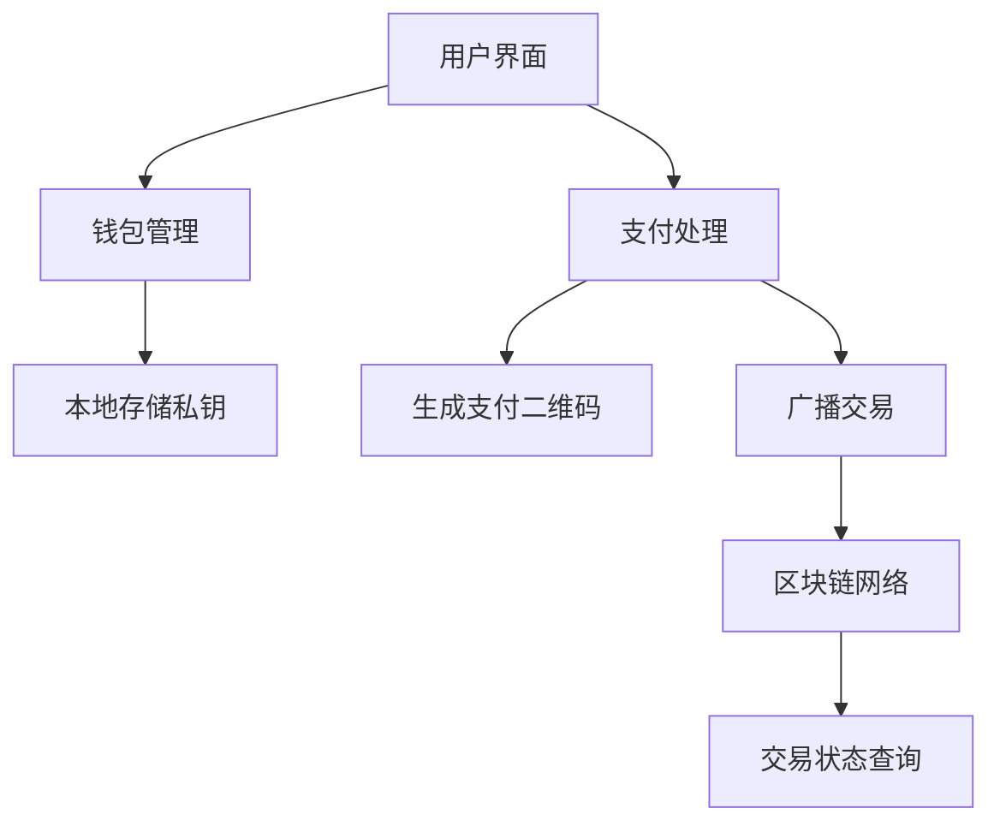

# BitSPV MicroPay

这是一个独立的 BSV 微支付组件/应用，旨在提供一个轻量级、易于集成的比特币SV（BSV）支付解决方案。它专注于核心支付功能，包括生成支付地址、显示二维码、监听入账以及广播交易。

## 特点

- **轻量级**：专注于支付核心功能，代码精简。
- **易于集成**：可作为独立页面或嵌入式组件集成到其他应用中。
- **非托管**：私钥本地生成和存储，用户完全掌控资金。
- **BSV 原生支持**：基于 `@bsv/sdk` 和 Paymail 协议。
- **国际化**：支持多语言。

## 技术栈

- **前端框架**：Vue 3
- **构建工具**：Vite
- **样式**：TailwindCSS
- **支付处理**：`@bsv/sdk` 和 `@cyio/ts-paymail`
- **国际化**：`vue-i18n`
- **状态管理**：Vue 组合式 API

## 架构概览



**关键业务逻辑：**

- **支付流程**：生成地址 → 显示二维码 → 监听入账 → 广播交易
- **钱包安全**：私钥本地存储 + 备份功能 + 清空确认

## 开发与部署

### 本地开发

1.  **安装依赖**：
    ```bash
    pnpm install
    ```
2.  **运行开发服务器**：
    ```bash
    pnpm dev
    ```
    应用将在 `http://localhost:5173` (或类似地址) 运行。

### 构建生产版本

```bash
pnpm build
```
构建产物将位于 `dist/` 目录。

## 贡献

欢迎对本项目进行贡献！如果您有任何功能建议、bug 报告或改进，请随时提交 Pull Request 或 Issue。

## 许可证

[待添加许可证信息]
